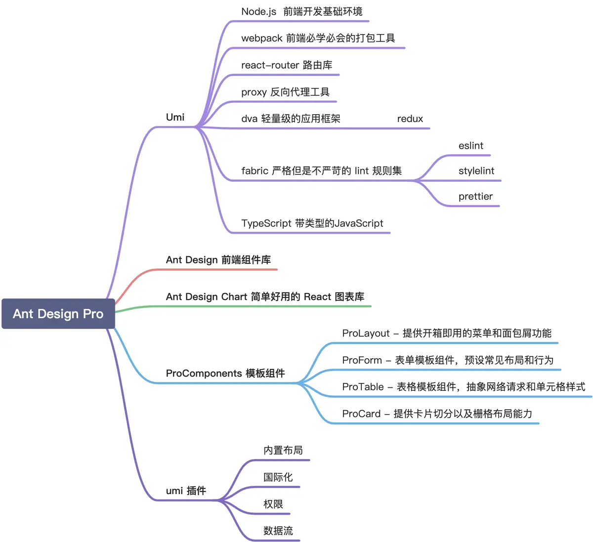

## 官网文档

1. [React](https://zh-hans.react.dev/)
2. [Ant Design](https://ant-design.antgroup.com/index-cn)
3. [Ant Design Pro](https://pro.ant.design/zh-CN)
4. [Umi](https://umijs.org/)

## 基础用法

### 组件 (Components)

React 的核心概念是组件。组件是独立、可复用的代码块，它们可以接受输入（称为 "props"）并返回 React 元素描述页面的一部分。组件可以是类组件或函数组件。

类组件

```js
import React, { Component } from 'react';

class MyComponent extends Component {
  render() {
    return <div>Hello, {this.props.name}!</div>;
  }
}
```

函数组件

```js
import React from 'react';

function MyComponent(props) {
  return <div>Hello, {props.name}!</div>;
}
```

###  JSX (JavaScript XML)

JSX 是一种 JavaScript 语法扩展，允许在 JavaScript 代码中编写类似 HTML 的语法。React 使用 JSX 来描述 UI

```js
const element = <h1>Hello, world!</h1>;
```

### Props (Properties)

Props 是组件的输入，类似于函数的参数。它们是只读的，用于传递数据和事件处理器

```js
function Welcome(props) {
  return <h1>Hello, {props.name}</h1>;
}
```

### State

State 是组件内部的数据存储，可以改变。State 的改变会触发组件的重新渲染。类组件和函数组件的 state 管理方式有所不同。

类组件中的 State

```js
class MyComponent extends React.Component {
  constructor(props) {
    super(props);
    this.state = { count: 0 };
  }

  render() {
    return (
      <div>
        <p>You clicked {this.state.count} times</p>
        <button onClick={() => this.setState({ count: this.state.count + 1 })}>
          Click me
        </button>
      </div>
    );
  }
}
```

函数组件中的 State (使用 Hook)

```js
import React, { useState } from 'react';

function MyComponent() {
  const [count, setCount] = useState(0);

  return (
    <div>
      <p>You clicked {count} times</p>
      <button onClick={() => setCount(count + 1)}>
        Click me
      </button>
    </div>
  );
}
```

### Lifecycle Methods (生命周期方法)

类组件有一系列生命周期方法，可以在组件的不同阶段执行代码，如挂载、更新和卸载。

主要生命周期方法

- componentDidMount()
- componentDidUpdate(prevProps, prevState)
- componentWillUnmount()

### Hooks

Hooks 是 React 16.8 引入的一种新特性，允许在不编写类组件的情况下使用 state 和其他 React 特性。

常用 Hook

- useState：状态钩子
- useEffect：副作用钩子
- useContext：上下文钩子
- useReducer：类似于 Redux 的状态管理钩子
- useRef：引用钩子

```js
import React, { useState, useEffect } from 'react';

function MyComponent() {
  const [count, setCount] = useState(0);

  useEffect(() => {
    document.title = `You clicked ${count} times`;
  }, [count]);

  return (
    <div>
      <p>You clicked {count} times</p>
      <button onClick={() => setCount(count + 1)}>
        Click me
      </button>
    </div>
  );
}
```

### Context

Context 提供了一种在组件树中共享数据的方法，而不必显式地通过每层组件传递 props

```js
const MyContext = React.createContext();

function MyProvider({ children }) {
  const value = { name: 'John' };
  return (
    <MyContext.Provider value={value}>
      {children}
    </MyContext.Provider>
  );
}

function MyComponent() {
  const context = React.useContext(MyContext);
  return <div>Hello, {context.name}!</div>;
}

function App() {
  return (
    <MyProvider>
      <MyComponent />
    </MyProvider>
  );
}
```

### React Router

React Router 是一个用于在 React 应用中实现路由的库

```js
import { BrowserRouter as Router, Route, Switch, Link } from 'react-router-dom';

function App() {
  return (
    <Router>
      <nav>
        <Link to="/">Home</Link>
        <Link to="/about">About</Link>
      </nav>
      <Switch>
        <Route exact path="/" component={Home} />
        <Route path="/about" component={About} />
      </Switch>
    </Router>
  );
}
```

### Redux

Redux 是一种用于管理应用状态的库，常与 React 一起使用。它提供了一个集中式的存储，使状态管理更加可预测

```js
import { createStore } from 'redux';

const initialState = { count: 0 };

function reducer(state = initialState, action) {
  switch (action.type) {
    case 'INCREMENT':
      return { count: state.count + 1 };
    default:
      return state;
  }
}

const store = createStore(reducer);

store.dispatch({ type: 'INCREMENT' });
console.log(store.getState()); // { count: 1 }
```


## create-react-app (CRA)

### 安装CRA

```shell
yarn global add create-react-app
```
### 创建项目

```shell
yarn create react-app my-app
```
### 常用命令

```shell
yarn start
yarn build
yarn test
yarn eject # 弹出配置，操作不可逆
```
### CRACO

可以使用 CRACO（Create React App Configuration Override）来扩展和自定义配置，避免 eject

安装CRACO

```shell
yarn add @craco/craco
```

修改 package.json
```shell
"scripts": {
  "start": "craco start",
  "build": "craco build",
  "test": "craco test"
}
```

创建 craco.config.js 文件，进行自定义配置。例如，配置 Ant Design 的 Less 支持

```js
const CracoLessPlugin = require('craco-less');

module.exports = {
  plugins: [
    {
      plugin: CracoLessPlugin,
      options: {
        lessLoaderOptions: {
          lessOptions: {
            modifyVars: { '@primary-color': '#1DA57A' },
            javascriptEnabled: true,
          },
        },
      },
    },
  ],
};
```

### ts

```shell
yarn create react-app my-ts-app --template typescript
```

### 路由

```shell
yarn add react-router-dom
```
创建`src/routes.js`配置路由
```js
import React from 'react';
import { BrowserRouter as Router, Route, Switch } from 'react-router-dom';
import Home from './Home';
import About from './About';

const Routes = () => (
  <Router>
    <Switch>
      <Route exact path="/" component={Home} />
      <Route path="/about" component={About} />
    </Switch>
  </Router>
);

export default Routes;
```

在index.js中使用Routes

```js
import React from 'react';
import ReactDOM from 'react-dom';
import './index.css';
import Routes from './routes';
import reportWebVitals from './reportWebVitals';

ReactDOM.render(
  <React.StrictMode>
    <Routes />
  </React.StrictMode>,
  document.getElementById('root')
);

reportWebVitals();
```

### 状态

```shell
yarn add redux react-redux @reduxjs/toolkit
```

集成

```js
import { configureStore } from '@reduxjs/toolkit';
import { Provider } from 'react-redux';
import rootReducer from './reducers';

const store = configureStore({
  reducer: rootReducer,
});

ReactDOM.render(
  <React.StrictMode>
    <Provider store={store}>
      <Routes />
    </Provider>
  </React.StrictMode>,
  document.getElementById('root')
);
```

## antd

### 安装使用

```shell
yarn add antd
```
```js
import React from 'react';
import { Button, DatePicker } from 'antd';
import 'antd/dist/antd.css'; // 引入 Ant Design 样式

const App: React.FC = () => {
  return (
    <div style={{ padding: 20 }}>
      <h1>Welcome to Ant Design</h1>
      <DatePicker style={{ marginBottom: 20 }} />
      <br />
      <Button type="primary">Ant Design Button</Button>
    </div>
  );
};

export default App;
```

### 配置主题

```shell
yarn add @craco/craco craco-less
```

package.json

```shell
"scripts": {
  "start": "craco start",
  "build": "craco build",
  "test": "craco test"
}
```

创建 craco.config.js 文件，并配置 Less 变量：


```js
const CracoLessPlugin = require('craco-less');

module.exports = {
  plugins: [
    {
      plugin: CracoLessPlugin,
      options: {
        lessLoaderOptions: {
          lessOptions: {
            modifyVars: { '@primary-color': '#1DA57A' }, // 自定义主颜色
            javascriptEnabled: true,
          },
        },
      },
    },
  ],
};
```

在项目中引入 Less 样式

```js
import 'antd/dist/antd.less'; // 引入 Ant Design 的 Less 样式
```

### 国际化

```shell
yarn add @ant-design/pro-layout
```

```js
import React from 'react';
import { ConfigProvider, DatePicker, message, Button } from 'antd';
import zhCN from 'antd/lib/locale/zh_CN';
import enUS from 'antd/lib/locale/en_US';

const App: React.FC = () => {
  const [locale, setLocale] = React.useState(zhCN);

  const changeLocale = () => {
    setLocale(locale === zhCN ? enUS : zhCN);
    message.info(`Locale changed to ${locale === zhCN ? 'English' : '中文'}`);
  };

  return (
    <ConfigProvider locale={locale}>
      <div style={{ padding: 20 }}>
        <Button onClick={changeLocale}>Change Locale</Button>
        <DatePicker style={{ marginLeft: 20 }} />
      </div>
    </ConfigProvider>
  );
};

export default App;
```

## Ant Design Pro

### 安装

```shell
npm i @ant-design/pro-cli -g 
pro create web_demo
yarn 
yarn start
```

安装过程中，会咨询安装simple 还是complete版本。

- simple： 为基础模板，只提供了框架操作的基本内容，
- complete： 包含了所有块，不适合作为基础模板进行二次开发。

如果报错：

```shell
Absolute route path "/*" nested under path "/user" is not valid. 
```

将`config/routes.ts`中404注释掉

```typescript
// {
//   component: '404',
//   path: '/*',
// },
```

### 架构



### 命令

```shell
yarn start
yarn build
yarn analyze # 做的事情与 build 的相同，会打开一个页面展示项目依赖信息，用来优化性能和包大小
yarn lint
yarn lint:fix
```

## Umi

### 安装使用

```shell
npm install -g umi
npx  create-umi@latest # 创建项目
yarn start # 启动
umi build
```

## 参考

[https://www.jianshu.com/p/6b7a032f19e5](https://www.jianshu.com/p/6b7a032f19e5)

[https://juejin.cn/post/7344536653463207973](https://juejin.cn/post/7344536653463207973)
