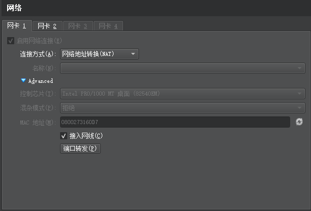
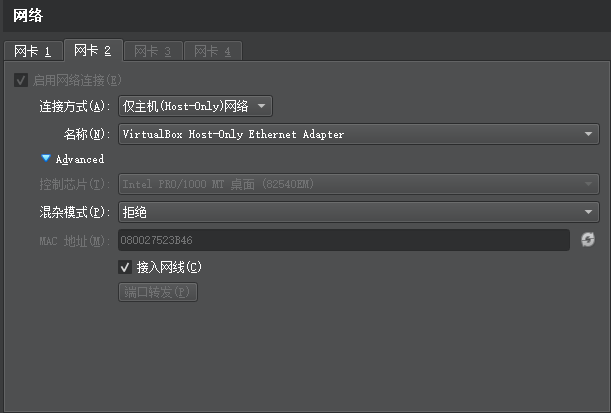

## VirtualBox中安装

> https://blog.csdn.net/Junkai_Wang/article/details/109114068

### 网络

安装后，虚拟机和主机可能不在同一个网段，需要虚拟机关机后设置网卡





然后

```shell
cd /etc/sysconfig/network-scripts
cp ifcfg-enp0s3 ifcfg-enp0s8
# 修改ifcfg-enp0s8中的`enp0s3`为`enp0s8`,uuid需要改个值
nmcli c reload
reboot
```

### ssh

```shell
systemctl start sshd.service # 开启
systemctl enable sshd.service # 开机自启
```

### 换源

```shell
# 进入yum的repos目录
cd /etc/yum.repos.d/

# 修改所有的CentOS文件内容
sed -i 's/mirrorlist/#mirrorlist/g' /etc/yum.repos.d/CentOS-*

sed -i 's|#baseurl=http://mirror.centos.org|baseurl=http://vault.centos.org|g' /etc/yum.repos.d/CentOS-*

# 更新yum源为阿里镜像
wget -O /etc/yum.repos.d/CentOS-Base.repo https://mirrors.aliyun.com/repo/Centos-vault-8.5.2111.repo

yum clean all

yum makecache

# yum安装测试是否可以yum安装
yum install wget –y
```

### 命令

```shell
ifconfig|more
```

右ctrl 退出

## 使用

### docker

#### 安装

> https://www.runoob.com/docker/centos-docker-install.html
> https://blog.csdn.net/weixin_43652442/article/details/127367939

```shell
yum -y install docker-ce --allowerasing

sudo systemctl start docker

```

#### 换源

```shell
sudo mkdir -p /etc/docker

sudo tee /etc/docker/daemon.json <<-'EOF'
{
  "registry-mirrors": ["https://rutcy2hi.mirror.aliyuncs.com"]
}
EOF

sudo systemctl daemon-reload
sudo systemctl restart docker
```

#### docker-compose

```shell
docker version # docker版本
curl -SL https://github.com/docker/compose/releases/download/v2.17.2/docker-compose-linux-x86_64 -o /usr/local/bin/docker-compose # 安装，如果服务器上下载不下来，就先在本地下载后上传上去
curl -L http://get.daocloud.io/docker/compose/releases/download/v2.17.2/docker-compose-`uname -s`-`uname -m` > /usr/local/bin/docker-compose # 国内安装，试过，有问题
sudo chmod +x /usr/local/bin/docker-compose
docker-compose --version # docker-compose版本
```

#### 使用

[使用](/tools/docker.html)