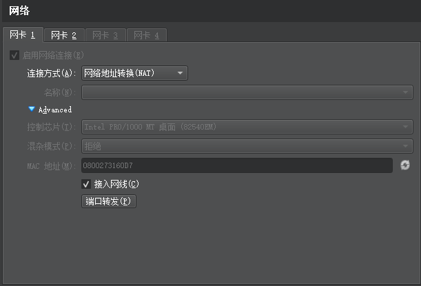
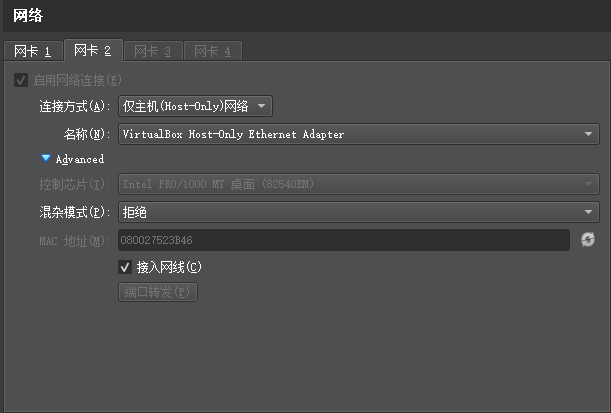

## 初始化

### 更新

安装环境之前将`Ubuntu20.04`切换到国内源下载安装包会快很多，切换源之后,需要在命令行中完成更新

点击左侧菜单底下 9 个点，找到 Software & Updates 修改

先得到软件包列表 `sudo apt-get update`

更新`ubuntu`和已安装的软件 `sudo apt-get dist-upgrade`

### root

先切换到 root 用户 `su root` (`Ubuntu`安装后,root 默认密码是一串随机字符串,可以用`sudo passwd`改密码)

### ssh

安装 ssh `apt-get install openssh-server`

使用`ps -e | grep ssh`，如果只有 ssh-agent 表示还没启动，需要`/etc/init.d/ssh start`；有`sshd`说明已启动。

`vim /etc/ssh/sshd_config`

`PermitRootLogin prohibit-password` 改成 `PermitRootLogin yes`

重启 `/etc/init.d/ssh restart`

### git

```shell
sudo apt-get install git
```

### 环境变量

在用户主目录下有一个 `.bashrc` 文件

## 开发环境

### `miniconda`
[miniconda](/python/tools.html#miniconda)

### `pyenv`
[pyenv](/python/tools.html#linux安装)


### `Node.js`

> 参考：[https://zhuanlan.zhihu.com/p/140961618](https://zhuanlan.zhihu.com/p/140961618)

#### 直接安装

```shell
sudo apt install nodejs npm
```

#### `nvm`安装

```shell
curl -o- https://raw.githubusercontent.com/nvm-sh/nvm/v0.35.3/install.sh | bash
```

脚本将会从 `Github` 克隆项目到`~/.nvm`文件夹，如果是`sudo`或使用 root 用户来执行这条命令，那么会克隆到`/root/.nvm`文件夹，重新打开终端

```shell
nvm --version
node --version
```

> 换源：[https://blog.csdn.net/qq_14815199/article/details/104610163](https://blog.csdn.net/qq_14815199/article/details/104610163)
>
> 在`ubuntu`中找到安装`nvm`的路径，找到`'.nvm/nvm.sh'`文件，用`sudo vim .nvm/nvm.sh`打开，然后用'/'搜索`‘NVM_NODEJS_ORG_MIRROR’`，enter 定位到该位置，修改其中的网址为`https://npm.taobao.org/mirrors/node/`即可

#### 常用命令

```shell
nvm list [available] # 查看本地安装的所有版本；有可选参数available，显示所有可下载的版本
nvm install 16.0.0 # 安装，命令中的版本号可自定义，具体参考上一命令查询出来的列表
nvm use 16.0.0 # 切换版本
nvm uninstall 16.0.0 # 卸载
```

### `phpstudy`

[https://www.cnblogs.com/tilv37/p/5117005.html](https://www.cnblogs.com/tilv37/p/5117005.html)

## 开发软件

`Ubuntu Software`中搜索安装

- `Visual Studio Code`
- `pycharm-community`

## 虚拟机扩容

```shell
sudo apt-get install gparted
```

1. 打开 `gparted`
2. 右键 `/dev/sda1`
3. 选择 `Resize/Move`
4. 鼠标拖动到最大，保存

## VirtualBox

### 安装

[https://blog.csdn.net/no1xium/article/details/108891360](https://blog.csdn.net/no1xium/article/details/108891360)

### 网络

安装后，虚拟机和主机可能不在同一个网段，需要虚拟机关机后设置网卡





### 代理

ubuntu : Settings > Network > Network Proxy

v2rayN : 设置 > 参数设置 > v2rayN设置 > 允许来自局域网的连接

命令行 :

```shell
# 设置代理
export http_proxy=http://192.168.56.1:10809
export https_proxy=http://192.168.56.1:10809
# 查看代理
env | grep -i proxy
# 取消代理
unset http_proxy
unset https_proxy
```

### 共享文件夹

默认目录为`/media/sf_share/`，也可以自定义目录，如果发现该目录没有权限，可以执行以下命令把当前用户添加到vboxsf用户组，重启后生效
```shell
sudo usermod -aG vboxsf $(whoami)
```

### 命令

```shell
右ctrl + F # 切换全屏
```


